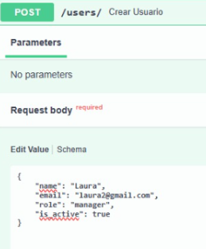
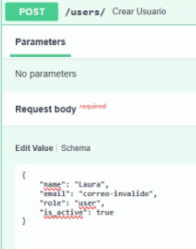
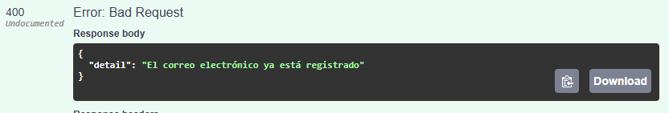
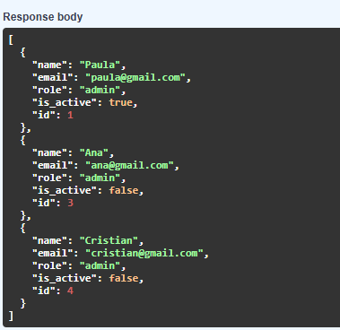
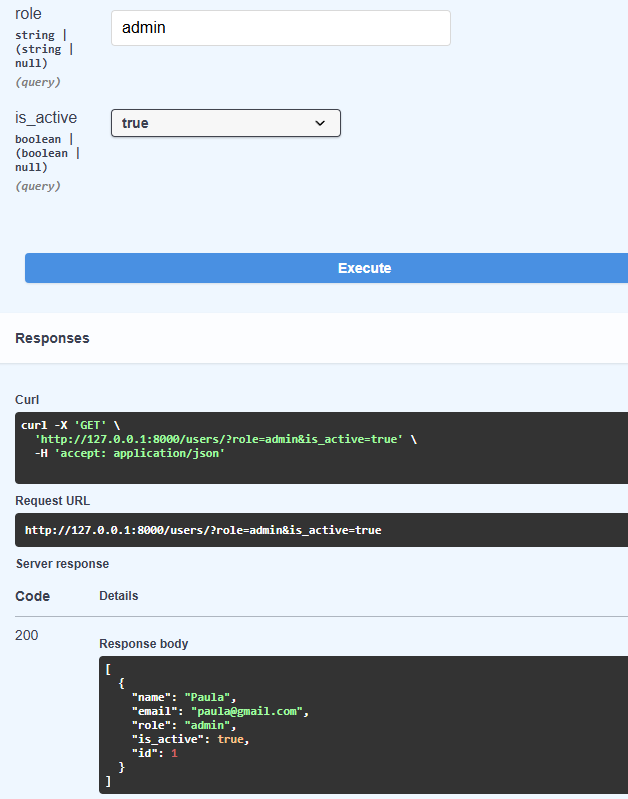
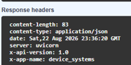
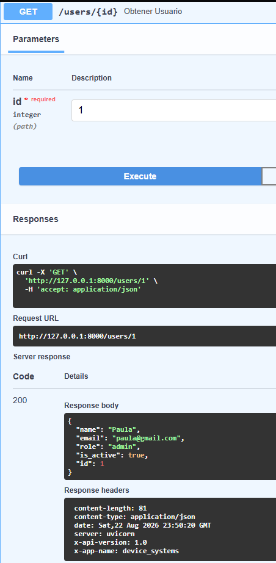
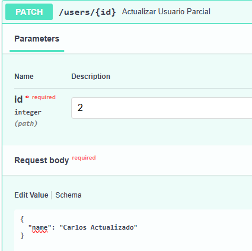
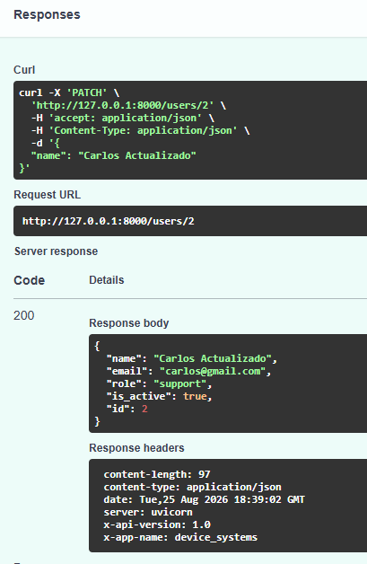
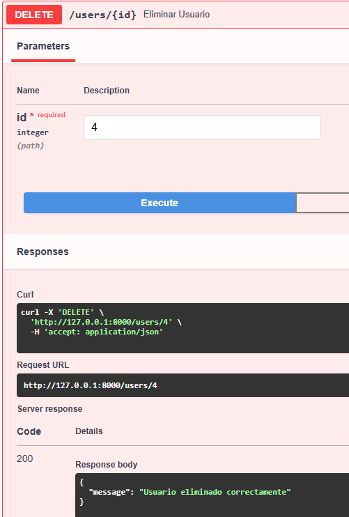

# API REST de Usuarios con FastAPI

## Descripción

Este proyecto consiste en el desarrollo de una **API REST para la gestión de usuarios**, construida utilizando **Python y FastAPI**.

La aplicación permite consultar, filtrar y registrar usuarios mediante diferentes endpoints HTTP. Para este proyecto se utiliza una lista de Python como 
**base de datos temporal**, por lo que la información se mantiene únicamente mientras la aplicación se encuentra en ejecución.

El proyecto está estructurado de manera modular, separando las rutas de la API y los esquemas de validación de datos.

---


## Estructura del proyecto

```text
devise_systems/
│
├── app/
│   ├── main.py
│   │
│   ├── routes/
│   │   └── user_routes.py
│   │
│   └── schemas/
│       └── user_schema.py
│
├── .gitignore
├── README.md
└── venv/
```

### Descripción de los archivos

#### `app/main.py`

Es el archivo principal de la aplicación.

En este archivo se:

* Crea la instancia de FastAPI.
* Configura el nombre, descripción y versión de la API.
* Define un middleware HTTP.
* Agregan las rutas de usuarios mediante `include_router()`.

#### `app/routes/user_routes.py`

Contiene los endpoints relacionados con la gestión de usuarios.

También contiene actualmente una lista llamada `base_datos`, utilizada como almacenamiento temporal de los usuarios.

#### `app/schemas/user_schema.py`

Contiene los modelos de datos utilizados para validar la información recibida y enviada por la API.

Se utilizan:

* `BaseModel`
* `EmailStr`
* `Field`
* `Literal`

#### `.gitignore`

Define archivos y carpetas que no deben ser enviados al repositorio Git, como:

* Entornos virtuales.
* Caché de Python.
* Archivos `.env`.
* Configuraciones de IDE.
* Logs.

---

## Modelo de usuario

Los usuarios manejados por la API contienen los siguientes atributos:

| Campo       | Tipo    | Descripción                      |
| ----------- | ------- | -------------------------------- |
| `id`        | Integer | Identificador único del usuario  |
| `name`      | String  | Nombre del usuario               |
| `email`     | Email   | Correo electrónico               |
| `role`      | String  | Rol del usuario                  |
| `is_active` | Boolean | Indica si el usuario está activo |

Los roles permitidos son:

* `admin`
* `support`
* `user`

Además, el nombre debe contener como mínimo **3 caracteres** y el correo debe cumplir con un formato válido.

---


# Endpoints

Todos los endpoints relacionados con usuarios utilizan el prefijo:

```text
/users
```

---

## 1. Obtener todos los usuarios

### Método

```http
GET /users/
```

Obtiene todos los usuarios registrados.

### Ejemplo

```http
GET http://127.0.0.1:8000/users/
```

### Respuesta

```json
[
    {
        "id": 1,
        "name": "Paula",
        "email": "paula@gmail.com",
        "role": "admin",
        "is_active": true
    }
]
```

---

## 2. Filtrar usuarios por rol

### Método

```http
GET /users/?role=admin
```

Permite obtener únicamente los usuarios que tengan un determinado rol.

### Roles disponibles

```text
admin
support
user
```

### Ejemplo

```http
GET /users/?role=admin
```

---

## 3. Filtrar usuarios por estado

También es posible filtrar los usuarios mediante el parámetro `is_active`.

### Usuarios activos

```http
GET /users/?is_active=true
```

### Usuarios inactivos

```http
GET /users/?is_active=false
```

---

## 4. Combinar filtros

Los parámetros pueden utilizarse simultáneamente.

Por ejemplo:

```http
GET /users/?role=admin&is_active=true
```

Esta consulta devuelve únicamente los usuarios que:

* Tienen el rol `admin`.
* Se encuentran activos.

---

## 5. Obtener un usuario por ID

### Método

```http
GET /users/{id}
```

Permite consultar un usuario específico utilizando su identificador.

### Ejemplo

```http
GET /users/1
```

### Respuesta

```json
{
    "id": 1,
    "name": "Paula",
    "email": "paula@gmail.com",
    "role": "admin",
    "is_active": true
}
```

Si el ID no existe, la API devuelve:

```json
{
    "detail": "Usuario no encontrado"
}
```

con código HTTP:

```text
404 Not Found
```

---

## 6. Crear un usuario

### Método

```http
POST /users/
```

Permite registrar un nuevo usuario.

### Body

```json
{
    "name": "Laura",
    "email": "laura@gmail.com",
    "role": "user",
    "is_active": true
}
```

### Respuesta

La API genera automáticamente el ID del nuevo usuario.

```json
{
    "id": 5,
    "name": "Laura",
    "email": "laura@gmail.com",
    "role": "user",
    "is_active": true
}
```

El código de respuesta es:

```text
201 Created
```

---

## 7. Actualizar un usuario con PUT

### Metodo 

```http
PUT /users/{id}
```

permite actualizar los datos completos de un usuario existente.

### Body

```json
{
    "name": "Paula Actualizada",
    "email": "paula.actualizada@gmail.com",
    "role": "support",
    "is_active": false
}
```

## Respuesta

```json
{
    "id": 1,
    "name": "Paula Actualizada",
    "email": "paula.actualizada@gmail.com",
    "role": "support",
    "is_active": false
}
```

El código de respuesta es:

```text
200 ok 
```

Si el usuario no existe la API devuelve:

```json
{
     "detail": "Usuario no encontrado"
}
```

Con código:

```text
404 Not Found
```

---

## 8. Actualizar parcialmente un usuario con PATCH

Permite enviar únicamente los campos que se desean modificar. Los demás datos permanecen sin cambios.

### Metodo 

```http 
PATCH /users/{id}
```

## Body 

```json 
{
    "name": "Carlos Actualizado"
}
```

## Respuesta

```json 
{
    "id": 2,
    "name": "Carlos Actualizado",
    "email": "carlos@gmail.com",
    "role": "support",
    "is_active": true
}
```

El código de respuesta es:

```text
200 ok 
```

Si el usuario no existe, la API devuelve:

```json 
{
    "detail": "Usuario no encontrado"
}
```

Con código:

```text
404 Not Found
```

---

### 9. Eliminar un usuario con DELETE

permite eliminar un usuario de la base de datos temporal.

## Metodo 

```http 
DELETE /users/{id}
```

```http 
DELETE /users/4
```

## Respuesta 

```json 
{
    "message": "Usuario eliminado correctamente"
}
```

El código de respuesta es: 

```text 
200 OK
```
---

## Diferencia entre PUT y PATCH

| Método |                 Fucion                   |
|--------|------------------------------------------|
|  PUT	 | Actualiza todos los datos del usuario    |
| PATCH	 | Actualiza únicamente los campos enviados |

---

# Manejo de errores

La API implementa diferentes códigos de estado HTTP para informar el resultado de las operaciones.

| Código | Significado                         |
| ------ | ----------------------------------- |
| `200`  | Solicitud procesada correctamente   |
| `201`  | Usuario creado correctamente        |
| `400`  | Datos no válidos o correo duplicado |
| `404`  | Recurso no encontrado               |

### Usuario inexistente

```json
{
    "detail": "Usuario no encontrado"
}
```

### Correo duplicado

Si se intenta registrar un usuario con un correo que ya existe:

```json
{
    "detail": "El correo electrónico ya está registrado"
}
```

---

# Validación de datos

La validación se realiza utilizando **Pydantic**.

El modelo `UserBase` establece las reglas principales:

```python
class UserBase(BaseModel):
    name: str = Field(..., min_length=3)
    email: EmailStr
    role: Literal["admin", "support", "user"]
    is_active: bool
```

Esto permite garantizar que:

* El nombre tenga mínimo 3 caracteres.
* El correo tenga un formato válido.
* El rol corresponda a uno de los valores permitidos.
* `is_active` sea un valor booleano.

---

# Middleware

El proyecto incluye un middleware HTTP en `main.py`.

Este middleware agrega automáticamente dos cabeceras a las respuestas:

```text
X-App-Name: device_systems
X-API-Version: 1.0
```

Estas cabeceras permiten identificar la aplicación y la versión de la API.

---

# Almacenamiento de datos

Actualmente el proyecto utiliza una lista de Python como almacenamiento temporal:

```python
base_datos = [
    ...
]
```

Esto significa que **no existe todavía una base de datos permanente**.

Los usuarios creados mediante la API se mantienen mientras el servidor está ejecutándose. Si la aplicación se reinicia, los nuevos registros se pierden y se recuperan únicamente los usuarios definidos inicialmente en el código.

Para una versión futura del proyecto se podría implementar una base de datos como:

* MySQL.
* PostgreSQL.
* SQLite.
* MongoDB.

---

# Pruebas

## Crear usuario


## Validación de error: nombre con caracteres insuficientes


## Validacion de error: rol incorrecto




## Validacion de error: Correo inavlido




## Validacion de error: correo duplicado

Agregamos un nuevo usuario


Ejecutamos nuevamente sin cambiar los aparemtros iniciales para comprobar que no se duplique





## Prueba del Get sin ingresar rol ni estado 


## Prueba de Get con rol





## Prueba de Get con estado


## Prueba de Get con estado y rol



## Cabeceras HTTP 



## Obtener usuario por ID




## Prueba de Put: actualizar usuario


## Prueba del Patch: actualizar nombre





## Prueba de Delete



---


# Autor

Aprendiz: Cristian Camilo Pereira Florez

Ficha: 3223877

Python FastApi

Tecnologo en analisis y desarrollo de software ADSO

CTMA - SENA

---