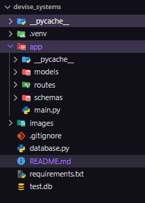
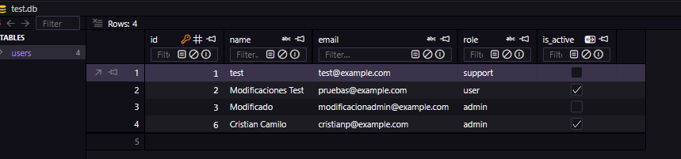

# Device Systems

API REST para la gestión de usuarios con Python, FastAPI, Pydantic, SQLAlchemy y SQLite.

## Descargar y ejecutar

```bash
git clone https://github.com/camilo51/fastAPI-introduccion.git
cd fastAPI-introduccion/devise_systems
```

En Windows PowerShell:

```powershell
py -m venv .venv
.\.venv\Scripts\Activate.ps1
pip install -r requirements.txt
uvicorn app.main:app --reload
```

La API queda disponible en `http://127.0.0.1:8000`.

- Swagger UI: <http://127.0.0.1:8000/docs>
- ReDoc: <http://127.0.0.1:8000/redoc>

## Estructura

```text
devise_systems/
├── app/
│   ├── main.py                 # Inicio de FastAPI
│   ├── models/                 # Tablas SQLAlchemy
│   ├── routes/                 # Rutas de la API
│   └── schemas/                # Validaciones Pydantic
├── images/                     # Evidencias de las pruebas
├── database.py                 # Conexión a SQLite
├── requirements.txt            # Dependencias
└── README.md
```

La estructura también se explica en el [README general](../README.md).



## Base de datos

Se utiliza SQLite. Al iniciar la aplicación se crea el archivo `test.db` y las tablas registradas en los modelos.

La tabla principal es `users` y contiene: `id`, `name`, `email`, `role` e `is_active`.



## Modelo SQLAlchemy y schema Pydantic

- El modelo SQLAlchemy, en `app/models/user.py`, representa la tabla `users` y permite guardar y consultar datos en SQLite.
- El schema Pydantic, en `app/schemas/user_schema.py`, revisa los datos que entran y salen de la API.

En resumen: SQLAlchemy trabaja con la base de datos y Pydantic valida la información de la API.

## Endpoints y evidencias

Todos los endpoints usan el prefijo `/users`.

| Endpoint | Función | Evidencia |
|---|---|---|
| `POST /users/` | Crear usuario |   |
| `GET /users/` | Listar usuarios |  |
| `GET /users/?role=admin` | Filtrar por rol |   |
| `GET /users/?is_active=true` | Filtrar por estado |  |
| `GET /users/{id}` | Buscar por ID |  |
| `PUT /users/{id}` | Actualizar todo |   |
| `PATCH /users/{id}` | Actualizar algunos campos |   |
| `DELETE /users/{id}` | Eliminar usuario |  |

Una respuesta de usuario tiene esta forma:

```json
{
  "id": 1,
  "name": "Laura",
  "email": "laura@gmail.com",
  "role": "user",
  "is_active": true
}
```

## Errores controlados

| Caso | Evidencia |
|---|---|
| Nombre muy corto |   |
| Rol no permitido |   |
| Correo inválido |   |
| Correo duplicado |    |
| Usuario no encontrado | La API responde `404 Not Found`. |
| `PATCH` sin campos | La API responde `400 Bad Request`. |
| ID cero o negativo | La API responde `422 Unprocessable Content`. |

Los códigos principales son `201` al crear, `200` en operaciones correctas, `400` para una actualización vacía, `404` si no existe el usuario, `409` para correo duplicado y `422` para datos inválidos.

## Otras evidencias

Las cabeceras agregadas por el middleware se muestran en `images/HTTP.png`:

```text
X-App-Name: device_systems
X-API-Version: 1.0
```

Las imágenes existentes corresponden a capturas de Swagger UI y de las respuestas de la API.

## Reflexión final

Usar persistencia es importante porque los datos no se pierden cuando se apaga o reinicia la aplicación. SQLite permite guardar la información de forma sencilla durante el desarrollo y SQLAlchemy facilita trabajar con las tablas desde Python.

## Estado del proyecto

El CRUD de usuarios está implementado. Los modelos y schemas de cursos e inscripciones están preparados, pero sus rutas todavía no están desarrolladas.

## Autor

Cristian Camilo Pereira Florez — Ficha 3223877 — SENA ADSO.
